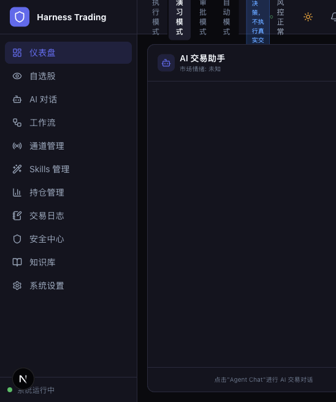
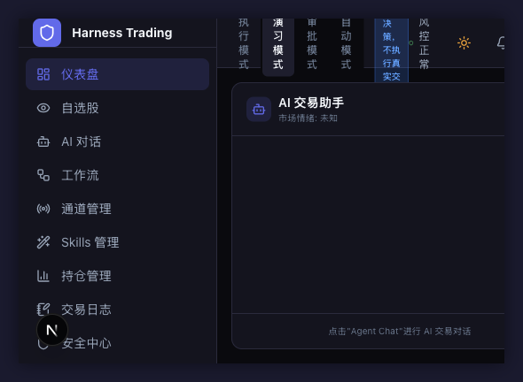
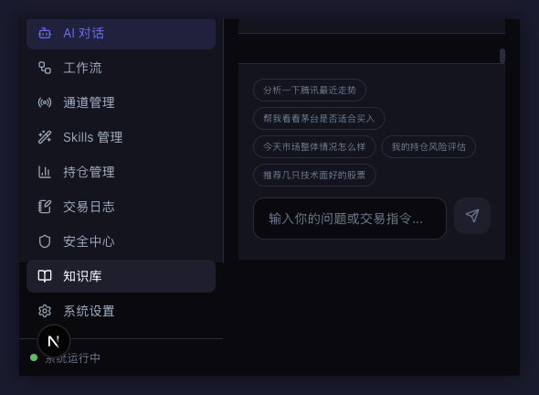
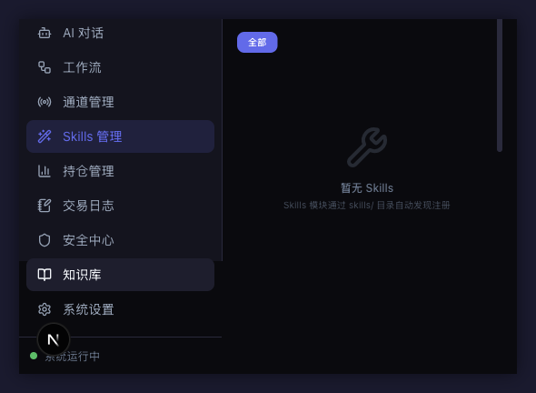
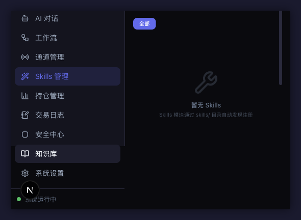
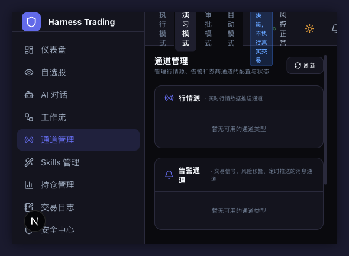
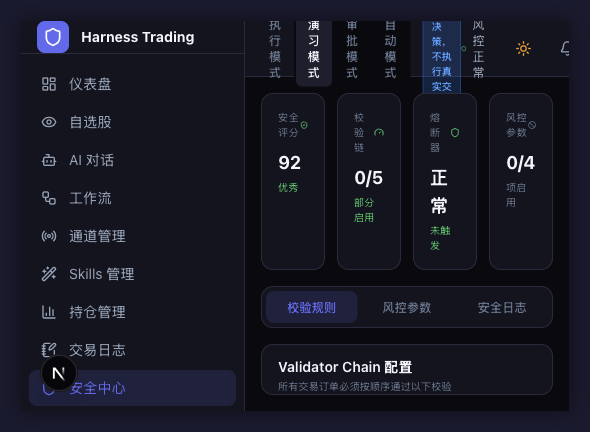

# Harness Trading

<p align="center">
  <strong>AI 操盘手 + 安全护栏</strong><br/>
  <em>用自然语言描述策略，AI 自动执行，每笔交易经过不可绕过的风控链。本地部署，数据不出你的机器。</em>
</p>

<p align="center">
  
</p>

<p align="center">
  <a href="LICENSE"></a>
  
  
  
  
  
</p>

---

## 一句话

**Harness Trading** 是一个本地部署的 AI 量化助手。你提供 LLM API Key，它帮你分析行情、执行策略、管理知识——所有交易命令都经过不可绕过的安全护栏。

> ⚠️ 默认 **模拟交易** 模式。真实券商接口在 Roadmap 中，尚未上线。交易有风险，请勿在生产环境绕过安全护栏。

---

## 为什么选 Harness Trading

|                          | 普通量化 Bot  | 云端 AI 交易 | **Harness Trading**      |
|--------------------------|-------------|-------------|--------------------------|
| 你的数据                | 本地         | 上传到云端     | **本地，你说了算**          |
| 工作流自定义             | 硬编码        | 不可见        | **YAML / Python 全可控**   |
| 多模型路由               | 单一厂商      | 单一厂商      | **DeepSeek / OpenAI / Claude / 本地 Ollama** |
| Skills 插件              | 罕见         | 闭源          | **自然语言创建 + 一键加载**   |
| 安全护栏                 | 手动检查      | 黑盒          | **声明式校验链，不可绕过**    |
| 默认模拟盘               | 可选         | 通常没有       | **默认硬控，先跑再真**       |

---

## 核心亮点

### 🔐 Safety Harness — 不可绕过的安全护栏

这是 Harness Trading 最核心的差异化能力。每一笔订单在到达券商前，必须经过声明式校验链：

| 校验项         | 默认行为                              |
|----------------|---------------------------------------|
| 价格偏离       | > 3% 偏离市场价 → 拒绝                |
| 数量检查       | 超大单自动拒绝                        |
| 订单类型       | 仅限限价单，市价单直接阻挡            |
| 交易时段       | 非交易时间封锁                        |
| 频率限制       | 30 分钟 5 笔上限                      |
| 风控控制器     | 日亏损上限 / 集中度 / 单笔上限        |
| 熔断器         | 触发后需人工复位                      |

三种执行模式：`dry_run`（仅记录）→ `approval`（人工审批）→ `auto`（风控内自动），渐进式放权。

### 📸 功能一览

|  |  |
|:--:|:--:|
| **仪表盘** — 实时 KPI · 行情概览 | **AI 对话** — 角色切换 · RAG 增强 |
|  |  |
| **知识库** — BM25 搜索 · AI 自主学习 | **Skills 管理** — 自然语言创建 · 在线编辑 |
|  |  |
| **通道管理** — 飞书·钉钉·企微 · 一键测试 | **安全中心** — 熔断器 · 风控链 · 执行模式 |

### 🤖 AI Agent 平台

- **5 个预注册 Agent 角色**：回测执行 / 策略设计 / 交易操作 / 风控审查 / 事件复盘
- **自然语言创建 Skills**：描述"找出 MACD 金叉且 RSI 在 30-70 的股票"，AI 自动生成可运行代码
- **BM25 知识库**：支持上传、搜索、AI 对话时自动关联相关知识（RAG）
- **4 个内置工作流**：策略定义 → 回测 → 模拟盘 → 实盘（YAML 驱动）

### 📡 插件通道

| 类型 | 已支持 |
|------|--------|
| 行情源 | 东方财富（A 股实时数据） |
| 告警 | 钉钉 · 飞书 · 企业微信 Webhook |
| 券商 | 模拟券商（本地撮合引擎） |

### 🎛️ 多模型路由

DeepSeek / OpenAI / Claude / Moonshot / Qwen / GLM / 本地 Ollama，按任务类型路由到不同模型。

---

## 快速开始

### 环境要求

- Python 3.12+ 和 Node 18+
- 一个 LLM API Key（推荐 [DeepSeek](https://platform.deepseek.com/)，便宜好用）

### 3 步启动

```bash
git clone git@github.com:your-org/harness-trading.git && cd harness-trading
cp .env.example .env
# 编辑 .env，填入 DEEPSEEK_API_KEY=sk-...
```

```bash
# 终端 1：启动后端
cd backend && pip install -r requirements.txt
python3 -m uvicorn app.main:app --host 0.0.0.0 --port 18766 --reload

# 终端 2：启动前端
cd frontend && npm install && npm run dev -- --webpack -p 3000
```

打开 `http://localhost:3000`，开始使用。

### Docker 启动

```bash
docker compose up -d
```

详细指南：[QUICKSTART.md](QUICKSTART.md)

---

## 项目结构

```
harness-trading/
├── backend/app/
│   ├── agent/          # AI Agent（Skills、Roles）
│   ├── api/            # REST 接口（/api/agent · /api/trading）
│   ├── channels/       # 插件通道（行情/告警/券商）
│   ├── eval/           # L1/L2/L3 评估框架
│   ├── harness/        # 安全护栏（校验链 + 熔断器）
│   ├── knowledge/      # BM25 全文搜索知识库
│   ├── llm/            # 多模型路由
│   └── workflows/      # YAML 工作流引擎
├── frontend/           # Next.js 16 前端（10 个页面）
├── config/             # harness.yaml + providers.yaml
├── docs/               # 技术文档
├── skills/             # 可插拔 Skill 模块
├── workflows/          # YAML 工作流定义
├── agents/             # Agent 角色描述
└── knowledge/          # Markdown 知识文档
```

---

## Roadmap

**已完成** ✅ · Skills 插件 · 安全护栏 · 模拟交易 · 多模型路由 · Web Dashboard · 工作流引擎 · Agent 角色 · 知识库 RAG · 渠道管理（飞书/钉钉/企微） · 交易日志 · 自选股 · Eval 评估 · 定时任务调度

**进行中** 🟡 · 真实券商适配器 · WebSocket 实时行情推送 · LLM 流式输出

**计划中** ⏸ · 多策略编排 · 组合级风控 · 审计日志 · 系统托盘 App

详见 [docs/roadmap.md](docs/roadmap.md)

---

## 贡献

欢迎贡献！查看 [CONTRIBUTING.md](CONTRIBUTING.md) 了解详情。

## 免责声明

本项目仅用于**研究和教育目的**。不构成投资建议。交易有风险，可能亏损。请勿在未完全理解系统每一层的情况下接入真实资金，切勿在生产中绕过安全护栏。维护者不对使用本软件造成的任何损失承担责任。

## License

MIT — [LICENSE](LICENSE)
