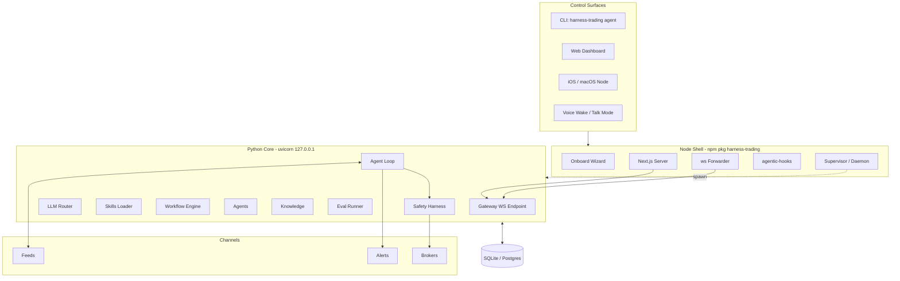

# Harness Trading — Phase 2 Tech Spec

**A Self-hostable AI Quant Assistant** · *Node shell + Python core*

> **Pivot note (supersedes v1)**
>
> v1 把项目讲成"Agentic scaffold for quant trading"。Phase 2 重新定位为：
>
> **OpenClaw 的量化版本 —— 你装在自己机器上、随时听你说话、连着你信任的行情和券商、戴着安全护栏的 AI 量化助理。**
>
> 形态学 [openclaw](https://github.com/openclaw/openclaw)：npm 全局包、Local-first Gateway、Onboard wizard、Channels 一等公民。
> 内核学 harness-env：Hooks 三层金字塔、Skills `SKILL.md` 协议、Workflows 工作流、多 Agent 协作、Knowledge 分层、Eval Harness。
> **栈型决策：Node 薄壳 + Python 厚核**。Node 装 npm 包、跑 onboard wizard、守护进程、承载跨 IDE hook 适配；Python 跑 FastAPI / Agent / Skills / 回测 / 安全护栏 —— 量化生态原生留在 Python，不强迁 TS。
>
> "可扩展"是次要卖点。**装上就能用**才是主卖点。

---

## 1. 定位与设计原则

### 1.1 一句话定位

```
Harness Trading is a self-hostable AI quant assistant. It runs on your own
machine, talks to your data feeds and brokers through pluggable channels,
and wraps every order in a Safety Harness. You bring keys; it brings
primitives.
```

### 1.2 设计原则（硬约束）

| # | 原则 | 含义 |
|---|------|------|
| P1 | **Local-first** | Gateway 跑在用户自己机器（`ws://127.0.0.1:<port>`），数据 / 密钥 / 决策从不离开本地，除非用户显式授权某 channel 出网 |
| P2 | **Install-to-useful in 60s** | `npm i -g harness-trading && harness-trading onboard` 一行起手，60 秒内能和 paper broker 跑通一笔 dry-run |
| P3 | **Channels are first-class** | Feeds / Alerts / Surfaces / Brokers 四类 channels 是一等公民，与 skills / workflows / agents 同级 |
| P4 | **Safety Harness is non-bypassable** | 任何 broker channel 提交的订单必须穿过 harness 校验链；plugin 不允许私自绕过 |
| P5 | **No `.qoder/` / no IDE-private dirs** | 所有资产平铺仓库根，与 Agent IDE 解耦 |
| P6 | **Hooks are an external package** | 跨 Agent 钩子抽成独立 npm 包 `agentic-hooks`，可被任何 Agentic 项目复用 |
| P7 | **Paper-only by default** | Live broker channel 永远是 opt-in 的 plugin，永远经 harness，永远要多重确认 |
| P8 | **Right-tool-for-the-job** | Node 干 Node 擅长的（CLI / hook / web）；Python 干 Python 擅长的（量化 / LLM SDK / 回测）；不强迁 |

### 1.3 主角与配角

```
主角（一等公民）        配角（基础设施）
─────────────────────   ─────────────────────
Channels  ← feeds       agentic-hooks (npm)
          ← alerts      Persistence (SQLAlchemy + SQLite)
          ← surfaces    Knowledge   (md + bm25)
          ← brokers     Evals       (L1/L2/L3)
Skills (handler.py)     Safety Harness (validator chain)
Workflows               Node Supervisor (进程管理)
Agents
```

---

## 2. 目标与非目标

### 2.1 目标（Phase 2 完成定义）

| # | 目标 | 验收 |
|---|------|------|
| G1 | **npm 全局包**：`npm i -g harness-trading` + `harness-trading onboard` 一条命令引导用户配 LLM key / feed / alert / paper broker | 全新机器 60 秒内跑通 dry-run order |
| G2 | **Local-first Gateway**：Python uvicorn 监听 `ws://127.0.0.1:<port>`，由 Node supervisor 启动 / 守护 / 重启 | `harness-trading gateway --install-daemon` 一键安装 launchd / systemd |
| G3 | **Channels 四类全上**：每类至少一个内置 + 一个外部 plugin 跑通 | feed=eastmoney + tushare-plugin / alert=dingtalk + telegram / surface=cli + web / broker=paper + mock-live |
| G4 | **`agentic-hooks` 通用包独立发布** 到 npm，提供 Claude / Codex / Cursor / Qoder 适配器 | `agentic-hooks bind --target=all` 工作 |
| G5 | **Skills 目录式协议**：`skills/<name>/{SKILL.md, handler.py, schema.json}`，启动时自动扫描注入 prompt | 4 个内置 skill：market-scan / technical / news-pulse / risk-check |
| G6 | **Workflows 4 条**：`strategy-spec / backtest / paper-trade / live-trade`，含用户确认门禁 | 一条想法 → spec → 回测 → 纸面 N 日全跑通 |
| G7 | **Agents 5 个角色**：strategy-designer / risk-reviewer / backtest-runner / trade-operator / incident-rca | 通过 workflow 编排链式调用 |
| G8 | **Persistence**：SQLAlchemy + SQLite（默认）/ Postgres（生产）+ alembic migration | 重启不丢 strategies / orders / sessions |
| G9 | **Eval Harness**：L1/L2/L3 三层断言 + 跨模型矩阵 | `harness-trading eval run` 出对比报告 |
| G10| **Web Dashboard 升级**：Next.js 16 / 19，新增 channels 配置面板 / workflow 触发面板 / eval 报告页 | 与 Python Gateway 通过 ws 实时通信 |
| G11| **macOS Menu Bar app**（选做） | tray app 显示 paper PnL + 一键唤起 voice mode |

### 2.2 非目标

- 不内置任何真实 broker（永远是 plugin，本仓库不发布任何 live broker 实现）
- 不做多用户 / RBAC / 计费（Phase 3）
- 不做策略市场 / 付费策略商店
- 不做基于不可篡改账本的合规审计（Phase 3）
- 不接入任何会暗示市场操纵 / 内幕的 channel
- **不发 PyPI 包**：分发面单一，只发 npm；Python 后端是 git clone 形态，由 Node 薄壳自动 `uv sync`
- 不强迁 Python 业务到 TS

---

## 3. 整体架构



`*` Live broker 类型为外部 plugin，本仓库只定义协议。

---

## 4. 目录布局（Phase 2 落地形态）

```
harness-trading/
├── README.md
├── QUICKSTART.md
├── package.json                   # 主 package：bin: harness-trading
├── pnpm-workspace.yaml
├── pyproject.toml                 # Python 后端依赖（uv 管理）
├── uv.lock
├── tsconfig.json
├── Makefile
├── docker-compose.yml             # 仍提供（容器化部署可选）
├── .env.example
│
├── packages/                      # Node 薄壳（pnpm workspace）
│   ├── cli/                       # bin: harness-trading
│   │   └── src/{onboard,gateway,agent,channel,skill,workflow,eval,doctor,update}.ts
│   ├── supervisor/                # Python 进程守护 + 健康检查 + 自动重启
│   │   └── src/{spawn,watchdog,daemonize}.ts
│   ├── ws-bridge/                 # Node ↔ Python ws 转发（CLI 调 Python）
│   ├── agentic-hooks/             # ⭐ 独立 npm 包（也独立发布）
│   │   └── src/{core,adapters,bridge,guards,cli}/
│   └── web/                       # Next.js 16 dashboard（升级 v1 frontend/）
│
├── backend/                       # Python 厚核（保留 v1，扩展）
│   ├── pyproject.toml
│   ├── app/
│   │   ├── main.py                # FastAPI + ws endpoint
│   │   ├── agent/                 # agent loop / llm router（保留扩展）
│   │   ├── skills/                # 内置 skill loader（不放业务 skill）
│   │   ├── workflows/             # workflow engine
│   │   ├── agents/                # agent dispatcher
│   │   ├── harness/               # safety harness（保留）
│   │   ├── persistence/           # sqlalchemy models + alembic
│   │   ├── knowledge/             # bm25 + 可选 embedding
│   │   ├── channels/              # channel 协议 + 内置 channel
│   │   │   ├── feeds/{eastmoney,binance,tushare}/
│   │   │   ├── alerts/{dingtalk,telegram,wework}/
│   │   │   └── brokers/{paper,mock_live}/
│   │   └── eval/
│   └── tests/
│
├── skills/                        # 业务 skill（用户可改、可加）
│   ├── market-scan/{SKILL.md,handler.py,schema.json}
│   ├── technical-analysis/
│   ├── news-pulse/
│   └── risk-check/
│
├── workflows/                     # 业务 workflow
│   ├── strategy-spec.md
│   ├── backtest.md
│   ├── paper-trade.md
│   └── live-trade.md
│
├── agents/                        # 角色定义
│   ├── strategy-designer.md
│   ├── backtest-runner.md
│   ├── risk-reviewer.md
│   ├── trade-operator.md
│   └── incident-rca.md
│
├── knowledge/                     # 分层知识库（学 harness-env）
│   ├── _meta/{taxonomy,catalog}.md
│   ├── strategies/
│   ├── instruments/
│   ├── errors/
│   ├── playbooks/
│   └── _candidates/
│
├── hooks/                         # 业务 hook handler（消费 agentic-hooks）
│   ├── on-prompt-submit/
│   ├── on-pre-tool-use/
│   ├── on-post-tool-use/
│   ├── on-stop/
│   └── agentic-hooks.config.ts
│
├── config/
│   ├── harness.yaml               # 安全护栏（保留）
│   ├── providers.yaml             # LLM 路由（保留）
│   ├── channels.yaml              # 新增：channels 启用 / 凭证引用
│   └── persistence.yaml
│
├── evals/
│   ├── cases/
│   ├── matrix.yaml
│   └── results/
│
├── docs/
│   ├── tech-spec-phase2.md        # 本文档
│   ├── extending-channels.md
│   ├── extending-skills.md
│   ├── extending-workflows.md
│   ├── broker-adapter-protocol.md
│   ├── node-python-bridge.md
│   └── architecture.md
│
└── .harness-trading/              # 运行时元数据（gitignore）
    ├── state/                     # session / circuit breaker / workflow runs
    ├── cache/                     # market data / embedding
    ├── secrets/                   # 加密 keys（用户机器 keychain 优先）
    ├── pids/                      # supervisor 维护的进程 pid
    └── logs/
```

> 与 v1 关键差异
> - `backend/` 保留并扩展（FastAPI / Agent / Safety Harness / SQLAlchemy 大部分沿用）
> - `frontend/` 拆到 `packages/web/`（Next.js 16 升级）
> - 新增 `packages/{cli,supervisor,ws-bridge,agentic-hooks}` Node 薄壳
> - Channels 上升一等公民：协议层在 `backend/app/channels/`，配置在 `config/channels.yaml`
> - 业务 skill / workflow / agent 平铺仓库根
> - 运行时元数据进 `.harness-trading/`（gitignore）
> - 不带 `.qoder/`

---

## 5. 分发与 Onboard

### 5.1 npm 全局包

| 项 | 决策 |
|---|------|
| 包名 | `harness-trading`（占位失败则 `@harness-trading/cli`） |
| bin | `harness-trading` |
| Node | ≥ 20（与 openclaw 对齐 22+） |
| 安装 | `npm i -g harness-trading` 或 `pnpm add -g harness-trading` |
| 大小 | < 5MB（Node 薄壳本体） |

**包内容**：仅 Node 薄壳（`packages/cli` + `packages/supervisor` + `packages/ws-bridge` + `packages/web` 编译产物 + `agentic-hooks` 复用）。**不打包 Python 后端**。

### 5.2 Python 环境处理（关键）

Node 薄壳通过 [astral-sh/uv](https://github.com/astral-sh/uv) 接管 Python 环境，对用户透明：

```
onboard 首次运行：
  1. 检测 python3.12+        ─→ 缺则提示：brew install python@3.12 / 跨平台官方包
  2. 检测 uv                  ─→ 缺则自动 curl -LsSf https://astral.sh/uv/install.sh | sh
  3. 检测 ~/.harness-trading/backend/  ─→ 缺则 git clone <repo>/backend 到该目录
                                        （或从 npm 包 postinstall 同步内嵌副本）
  4. uv sync                  ─→ 自动建 venv、安装 backend 依赖
  5. 写 ~/.harness-trading/config.yaml
  6. supervisor 启动 uvicorn  ─→ 监听 127.0.0.1:18790
```

> **trade-off**：用户机器需 Python 3.12（最常被诟病的安装摩擦）。可接受，因为目标用户是量化用户，本来就有 Python；一行 brew 即可。极端情况退路：发布预编译 backend zip 在 GitHub Release，onboard 解压而不依赖 git clone。

### 5.3 Onboard wizard

```bash
$ harness-trading onboard --install-daemon

  ✓ Found python3.12 (/opt/homebrew/bin/python3.12)
  ✓ Installed uv (v0.5.x)
  ✓ Cloned backend → ~/.harness-trading/backend
  ✓ uv sync (took 12.3s)

? Pick your primary LLM provider                      › DeepSeek
? Paste your DEEPSEEK_API_KEY                         › sk-***
? Add a market data feed                              › eastmoney (built-in)
? Add an alert channel                                › dingtalk
? Paste DingTalk webhook                              › https://oapi.dingtalk.com/...
? Pick your broker (paper-only available today)       › paper
? Default execution mode                              › dry_run
? Install gateway as a daemon (launchd / systemd)?    › Yes

✓ Wrote ~/.harness-trading/config.yaml
✓ Installed daemon (launchd com.harness-trading.gateway)
✓ Gateway online: ws://127.0.0.1:18790
✓ Dashboard:      http://127.0.0.1:18791

  Next:
    harness-trading agent --message "Analyse 600519"
    harness-trading workflow run strategy-spec
```

### 5.4 Local-first Gateway

| 项 | 决策 |
|---|------|
| 后端实现 | Python uvicorn + FastAPI ws endpoint（`backend/app/main.py`） |
| 前端启动 | Node `supervisor` spawn `uv run uvicorn app.main:app --host 127.0.0.1 --port 18790` |
| 协议 | WebSocket，JSON 帧 |
| 端口 | 默认 18790（gateway）+ 18791（next.js dashboard） |
| 远程访问 | Tailscale Serve / Cloudflare Tunnel / SSH tunnel（学 openclaw，不内置外网代理） |
| 认证 | onboard 自动生成 token，写到 `.harness-trading/secrets/gateway.token` |
| 守护 | macOS launchd plist / Linux systemd user unit / Windows Task Scheduler |
| 健康检查 | Node supervisor 每 10s ping ws，连续 3 次失败重启 |
| 配置热更 | Python 监听 `config/*.yaml` mtime，5s 节流重载 |

### 5.5 配套子命令

```bash
harness-trading onboard                        # 引导式
harness-trading gateway start | stop | status | logs
harness-trading gateway --install-daemon
harness-trading doctor                         # 自检
harness-trading update [--channel stable|beta]
harness-trading channel list / add / remove / test
harness-trading skill   list / new / install
harness-trading workflow list / run / confirm
harness-trading agent --message "..." [--surface cli|web]
harness-trading order submit / list / cancel   # 必经 harness
harness-trading eval run [--matrix=models.yaml]
```

CLI 90% 命令本质是"打包参数发 ws 帧给 Python Gateway"，由 `packages/ws-bridge` 实现。

---

## 6. Node ↔ Python 桥接

### 6.1 进程拓扑

```
Node Supervisor (PID 主)
   ├── spawn: uv run uvicorn app.main:app    (PID 子，ws://127.0.0.1:18790)
   ├── spawn: next start packages/web        (PID 子，http://127.0.0.1:18791)
   └── 健康检查 / 日志聚合 / 自动重启
```

### 6.2 通信协议

| 场景 | 协议 |
|---|------|
| CLI → Python | ws JSON 帧（`packages/ws-bridge`） |
| Web Dashboard → Python | ws JSON 帧（同 endpoint） |
| Hook（agentic-hooks）→ Python | HTTP POST `127.0.0.1:18790/hooks/<event>`（同步） |
| Python → Alert channels | 由 Python 直接发出（webhook/HTTP），Node 不参与 |
| Python → Feed channels | 由 Python 拉取，Node 不参与 |

### 6.3 帧格式

```json
{
  "id": "req-20251029-001",
  "kind": "agent.message | workflow.run | order.submit | channel.test | ...",
  "payload": { "...": "..." },
  "auth": { "token": "..." },
  "meta": { "surface": "cli|web|ios", "client_version": "0.2.0" }
}
```

### 6.4 错误传递

- Python 抛 `HarnessError(code, message, hint)` → Node 透传给 CLI / Web，code 决定退出码
- supervisor 检测到 Python 异常退出 → 收集 stderr 尾 200 行 → 写 `.harness-trading/logs/crash-<ts>.log` + 重启
- Hook 调用超时（默认 5s）→ Node 兜底返回 `{"continue": true}`，不阻塞 Agent IDE

### 6.5 数据所在

> **铁律**：账本 / 持仓 / 订单 / 策略源码只存 Python 侧 SQLite（`.harness-trading/state/db.sqlite`）。Node 侧不持久化业务数据，只持久化进程 pid + 日志 + supervisor 状态。

---

## 7. Channels 子系统（一等公民）

### 7.1 四类 channels

| 类型 | 量化版本里的 channel | 内置示例 | 实现侧 |
|---|---|---|---|
| **Feed Channels**（输入）| 行情 / 新闻 / 数据 | eastmoney / tushare / binance-ws | Python（pandas / akshare 生态原生） |
| **Alert Channels**（输出）| 告警 / 播报 / 总结 | dingtalk / telegram / wework / email | Python（requests 即可，少量也可放 Node 例如 webhook 风格） |
| **Control Surfaces**（人机）| 你在哪里跟它对话 | cli / web / ios（Tailscale） / voice | Node（CLI / Next.js） + Python（ws endpoint） |
| **Broker Channels**（执行）| 真实下单出口 | paper / mock-live / ib*(plugin) / binance*(plugin) | Python（vnpy / ccxt 生态原生），且**必须**经 harness |

`*` 标记的 broker 为外部 plugin。

### 7.2 Channel 协议（Python 侧）

```python
# backend/app/channels/protocol.py
from typing import Protocol, AsyncIterator

class FeedChannel(Protocol):
    name: str
    risk_class: str  # "read_only"
    async def quote(self, symbol: str) -> Quote: ...
    async def stream(self, symbols: list[str]) -> AsyncIterator[Tick]: ...
    async def health(self) -> HealthStatus: ...

class AlertChannel(Protocol):
    name: str
    risk_class: str  # "side_effect_external"
    async def notify(self, msg: AlertMessage) -> AlertReceipt: ...
    async def health(self) -> HealthStatus: ...

class BrokerChannel(Protocol):
    name: str
    risk_class: str  # "money_at_risk"
    async def submit(self, order: Order, harness_token: HarnessToken) -> OrderReceipt: ...
    async def cancel(self, order_id: str) -> CancelReceipt: ...
    async def positions(self) -> list[Position]: ...
    async def health(self) -> HealthStatus: ...
```

> **关键约束**：`BrokerChannel.submit` 必须接受 `HarnessToken`，否则 channel registry 拒绝注册。Token 由 `harness/validator.py` 通过校验链后签发，单次有效，绑定 order_id。

### 7.3 Channel 元数据（manifest）

每个 channel 是一个 Python 子模块 + `channel.yaml`：

```yaml
# backend/app/channels/feeds/eastmoney/channel.yaml
name: eastmoney
type: feed
display_name: 东方财富
version: 0.1.0
risk_class: read_only
needs_credentials: false   # 公开数据
needs_proxy: false
network_required: true
notes: |
  通过 curl 子进程绕 macOS 代理（详见 src/data_provider.py）
```

### 7.4 Channels 注册与启用

```yaml
# config/channels.yaml
feeds:
  - eastmoney
  - { name: tushare, credential_ref: TUSHARE_TOKEN }
alerts:
  - { name: dingtalk, credential_ref: DINGTALK_WEBHOOK }
brokers:
  - paper
```

启动时 Python registry 扫描 `backend/app/channels/<type>/<name>/` 并按 yaml 启用。Onboard wizard 引导用户写这份 yaml。

---

## 8. agentic-hooks 通用包（独立 npm 发布）

### 8.1 为什么独立

- harness-env 当前 hook 链强绑定 `.qoder/`；本项目要解耦，让任何 Agentic 项目都能用
- openclaw / 其他 OSS 也会受益
- 独立 release 节奏（不被 harness-trading 主版本拖累）

### 8.2 包结构

```
packages/agentic-hooks/
├── package.json              # name: agentic-hooks
├── src/
│   ├── core/                 # 6 标准事件、handler 加载、调度
│   ├── adapters/
│   │   ├── claude.ts         # ~/.claude/settings.json
│   │   ├── codex.ts          # ~/.codex/hooks.json
│   │   ├── cursor.ts         # .cursor/hooks/...
│   │   ├── qoder.ts          # ~/.qoder/hooks.json
│   │   └── generic-stdio.ts  # 通用 stdio 协议
│   ├── bridge/               # 跨 Agent recent-sessions.jsonl
│   ├── guards/               # 内置 guard：path / cmd / domain blacklist
│   └── cli/                  # bin: agentic-hooks bind / unbind / doctor / list
└── examples/                 # 复用样例
```

### 8.3 标准 6 事件

| 事件 | 时机 | 典型用途 |
|---|------|----------|
| `SessionStart` | 会话开始 | 注入跨 Agent 上下文 / 加载用户偏好 |
| `UserPromptSubmit` | 用户提交输入 | 注入项目状态 / 触发规则 / 拦截危险 prompt |
| `PreToolUse` | 工具调用前 | 高风险工具拦截（live-order / rm -rf） |
| `PostToolUse` | 工具调用后 | 写日志 / 触发 lint / 校验输出 |
| `Stop` | 主轮次结束 | 写 handoff / 校验产物 |
| `SessionEnd` | 会话结束 | 落 journal |

### 8.4 项目侧消费方式

```ts
// hooks/agentic-hooks.config.ts
import { defineHooks } from "agentic-hooks";

export default defineHooks({
  handlers: {
    UserPromptSubmit: ["./hooks/on-prompt-submit/inject-portfolio-state.ts"],
    PreToolUse: [
      "./hooks/on-pre-tool-use/live-order-confirm.ts",
      "./hooks/on-pre-tool-use/circuit-breaker-guard.ts",
    ],
    PostToolUse: ["./hooks/on-post-tool-use/order-audit-log.ts"],
    Stop: ["./hooks/on-stop/check-position-consistency.ts"],
  },
  bridge: {
    recentSessionsPath: ".harness-trading/state/recent-sessions.jsonl",
  },
  adapters: ["claude", "codex", "cursor", "qoder"],
});
```

```bash
agentic-hooks bind --target=all      # 一键写到 4 个 IDE 配置
agentic-hooks doctor                  # 跨 IDE 自检
agentic-hooks list                    # 看哪些 handler 被注册
```

### 8.5 与 Python Gateway 的关系

业务 hook handler 通常需要项目状态（如 portfolio 实时持仓）。handler 通过 HTTP `POST 127.0.0.1:18790/hooks/<event>` 调用 Python Gateway。Gateway 提供：

```
POST /hooks/portfolio-snapshot   # 给 inject-portfolio-state.ts 用
POST /hooks/circuit-breaker-state
POST /hooks/recent-orders?n=5
```

---

## 9. Skills 子系统

### 9.1 SKILL.md 协议（与 harness-env 对齐，加量化字段）

```yaml
---
name: technical-analysis
description: 技术指标计算 / 均线 / MACD / RSI / 布林带 / 形态识别
when_to_use:
  - 用户问"这只票走势怎么看 / 找突破均线"
  - workflow=strategy-spec 阶段需要给策略加技术指标过滤
when_to_skip:
  - 单纯查实时价格 → 走 market-scan
  - 基本面分析 → 不在范围
inputs:
  - symbol: string  required
  - period: string  default=daily  enum=[1m,5m,15m,30m,60m,daily,weekly]
  - indicators: list  required
outputs:
  - indicator_values: dict
  - signals: list[Signal]
risk_class: read_only       # read_only / side_effect_local / money_at_risk
side_effects: []
mode: sync
estimated_latency_ms: 1500
llm_friendly_summary: |
  Returns indicator series and signal events. Cached for 5min if freshness=normal.
---
# Skill: Technical Analysis
... (handler 如何调用、错误码、示例)
```

### 9.2 handler.py（Python 默认）

```python
# skills/technical-analysis/handler.py
from harness_trading.skill_kit import skill, Result, ValidationError
import pandas as pd, talib

@skill(name="technical-analysis", schema_path="schema.json")
async def run(ctx, inputs) -> Result:
    df = await ctx.feed("eastmoney").fetch_kline(
        inputs["symbol"], period=inputs["period"], n=200
    )
    out = {"indicator_values": {}, "signals": []}
    for ind in inputs["indicators"]:
        if ind == "MACD":
            macd, signal, hist = talib.MACD(df["close"])
            out["indicator_values"]["MACD"] = macd.tail(20).tolist()
            ...
    return Result.ok(out)
```

> 量化生态原生：直接用 talib / pandas / numpy / akshare。

### 9.3 skill 加载流程

启动时（Python `backend/app/skills/loader.py`）：

1. 扫描仓库根 `skills/<name>/SKILL.md`
2. 解析 frontmatter，校验必填字段
3. 装载 `handler.py`（importlib），找到被 `@skill` 装饰的函数
4. 注册到 `SkillRegistry`
5. 启动时把 `name + description + when_to_use + risk_class` 注入到 LLM system prompt

### 9.4 安装外部 skill

```bash
harness-trading skill install github:user/awesome-quant-skill
# → 克隆到 skills/awesome-quant-skill/
# → uv pip install -r requirements.txt（如有）
# → harness-trading doctor 校验
```

---

## 10. Workflows 子系统

### 10.1 Workflow 协议

```yaml
---
name: paper-trade
display_name: 纸面交易（无真实风险）
description: 把策略丢进 paper broker，跑 N 天，每日总结
inputs:
  - strategy_id: int  required
  - days: int  default=5
  - capital: number  default=100000
stages:
  - id: prep
    title: 校验策略 + 资金 + 时段
    requires: ["strategy_id"]
  - id: simulate
    title: 推送 N 个交易日的模拟订单
    needs: [prep]
    skill: backtest-runner
  - id: review
    title: 每日总结（盈亏 / 滑点 / 命中率）
    needs: [simulate]
    skill: trade-operator
gate: user_confirm           # 进入下一阶段前必须用户 OK
on_failure: rollback
---
# Workflow: Paper Trade
（详细 step-by-step prompt + 校验逻辑）
```

### 10.2 4 条内置 workflow

| name | 职责 | 是否触达 broker |
|---|---|---|
| `strategy-spec` | 想法 → 可执行策略 spec（指标 / 信号 / 风控） | ❌ |
| `backtest` | 跑历史回测 + 报告 | ❌ |
| `paper-trade` | 投递到 paper broker，N 日观察 | ✅（paper 仅） |
| `live-trade` | 投递真实 broker（外部 plugin），强 gate + harness | ✅（live） |

### 10.3 Workflow 引擎（Python 侧）

```python
# backend/app/workflows/engine.py
async def run_workflow(name: str, inputs: dict, surface: Surface):
    wf = registry.load(name)
    for stage in wf.stages:
        if wf.gate == "user_confirm":
            await surface.confirm(f"Proceed to {stage.title}?")
        result = await dispatch_skill(stage.skill, ctx={**inputs, **collected})
        ...
```

---

## 11. Agents 子系统

### 11.1 Agent 协议

```yaml
---
name: trade-operator
mode: read_write
allowed_skills: [technical-analysis, market-scan, risk-check]
allowed_channels: [eastmoney, dingtalk, paper]
banned_tools: [shell.exec, file.delete]
llm_routing:
  primary: deepseek-v3
  fallback: claude-3-5-sonnet
  reasoning: claude-3-7-sonnet  # 复杂决策走推理模型
system_prompt_extends: ./agents/_base/trader-base.md
---
# Agent: Trade Operator
（详细职责 / 越界判断 / 决策框架）
```

### 11.2 5 个内置角色

| name | 职责 | 触达 broker |
|---|---|---|
| `strategy-designer` | 把模糊想法翻译成 spec | ❌ |
| `risk-reviewer` | 审策略 + 仓位 + 单笔 | ❌（只读） |
| `backtest-runner` | 跑回测 + 解读报告 | ❌ |
| `trade-operator` | 操作 paper broker | ✅（paper） |
| `incident-rca` | 出问题 RCA（盘中异常 / channel 失败） | ❌ |

### 11.3 Agent 调度

Workflow 内部按 stage 拉起对应 Agent；Agent 通过 LLM Router 选择模型；每次 LLM 调用前后都会经 PreToolUse / PostToolUse hook。

---

## 12. Safety Harness（保留并增强）

v1 已有 7 项校验（仓位 / 单笔 / 日内损失 / 频率 / 黑白名单 / 时段 / 熔断器），Phase 2 在此基础上：

| 增强 | 内容 |
|---|---|
| Token 化 | `submit(order, harness_token)` —— 没 token 直接拒（确保 channel 不能绕过） |
| 多重确认 | live broker 必须经 `surface.confirm` 二次人手按键 |
| 审计 | 每次 submit / cancel 写 `audit_log` 表（append-only） |
| 熔断分级 | red / yellow / green，红线触发 supervisor 杀 Python 进程并发 alert |
| 模式锁 | `harness.yaml.execution_mode` 启动后只读，运行时不可改（除非重启） |
| 配置签名 | `harness.yaml` SHA256 写入 startup log，篡改会在 doctor 输出告警 |

---

## 13. Persistence（保留 Python 栈）

| 项 | 决策 |
|---|------|
| ORM | SQLAlchemy 2.x（v1 已选） |
| 默认 DB | SQLite（`.harness-trading/state/db.sqlite`） |
| 生产 DB | Postgres（在 docker-compose 拉起） |
| Migration | alembic |
| KV / Cache | 内置 `aiocache`（in-memory + 可选 Redis） |
| 加密 | secrets 写 macOS Keychain / Linux libsecret，DB 内只存 ref |

### 核心 Models（Phase 2 设计版，Sprint 1 仍可调整）

```python
# backend/app/persistence/models.py

class Strategy(Base):
    id: int (pk)
    name: str
    spec_md: str            # markdown spec
    spec_sha256: str
    status: enum  # draft / approved / paused / archived
    created_at, updated_at

class Order(Base):
    id: int (pk)
    strategy_id: fk(Strategy)
    broker_channel: str     # paper / ib / ...
    symbol, side, qty, price, type
    harness_token_id: fk(HarnessToken)
    status: enum  # pending / submitted / filled / cancelled / rejected
    audit_trail: jsonb

class Position(Base):
    strategy_id, symbol, qty, avg_price, mark_price, pnl

class AgentSession(Base):
    id: uuid (pk)
    surface: str            # cli / web / ios
    started_at, ended_at
    summary_md: str

class SkillInvocation(Base):
    session_id: fk(AgentSession)
    skill_name, inputs_json, outputs_json
    latency_ms, status, error_code
    cost_usd: numeric

class HarnessToken(Base):     # 一次性，绑定 order_id
    id: uuid (pk)
    order_intent_hash: str
    expires_at: datetime
    consumed_at: datetime?
```

---

## 14. Knowledge 子系统（学 harness-env）

### 14.1 分层

```
knowledge/
├── _meta/
│   ├── taxonomy.md           # 分类规则
│   └── catalog.md            # 索引（自动生成）
├── strategies/               # 策略模式（如"破位回踩"）
├── instruments/              # 品种知识（A 股 / 港股 / 美股 / 加密 等）
├── errors/                   # 错误码（broker / channel 错误对照）
├── playbooks/                # 应急预案（盘中熔断 / channel 离线）
└── _candidates/              # 候选区，promote 才进正式桶
```

### 14.2 检索

- **MVP**：bm25（`rank_bm25`），token = jieba（中文）+ ASCII 切词
- **可选**：embedding rerank（默认关，开了走本地 model 或 LLM provider 的 embedding API）
- **触发**：Agent system prompt 内置 `kb.search(query)` 工具

### 14.3 候选区流程

参考 harness-env：用户对话沉淀的内容先进 `_candidates/`，由 `harness-trading skill knowledge promote` 显式提升到正式桶（带 reviewer 校验）。

---

## 15. Eval Harness

### 15.1 三层断言

| 层 | 断言方式 | 适用 |
|---|---|---|
| L1 字面 | `expected_contains` / `json_path` / `regex_match` | skill 单测、handler 输出形 |
| L2 LLM-judge | claude-haiku 单 judge，rubric 在 case 里 | 策略 spec 质量、回答完备性 |
| L3 回测 PnL | 跑回测，断言 sharpe ≥ X / max_drawdown ≤ Y | workflow=backtest 端到端 |

### 15.2 跨模型矩阵

```yaml
# evals/matrix.yaml
models:
  - deepseek-v3
  - claude-3-5-sonnet
  - claude-3-7-sonnet
  - gpt-4o
suites:
  - skills/technical-analysis/eval.yaml
  - workflows/strategy-spec/eval.yaml
```

### 15.3 跑法

```bash
harness-trading eval run --suite skills/technical-analysis --model all
# → 输出 evals/results/<ts>/report.md + 跨模型对比表
```

---

## 16. 与 v1 现状的迁移路径

| v1 资产 | Phase 2 处置 | 工作量 |
|---|---|---|
| `backend/app/main.py` (FastAPI) | **保留并扩展** ws endpoint | S |
| `backend/app/agent/*` | **保留**，加 LLM Router 的 reasoning 通道 | S |
| `backend/app/agent/skills/{market_data,technical}.py` | **迁移**到目录式 `skills/<name>/{SKILL.md, handler.py}` | M |
| `backend/app/safety/*` | **保留**，加 HarnessToken | S |
| `backend/app/persistence/*` | **保留**，扩 Order / HarnessToken / SkillInvocation | M |
| `frontend/` (Next.js) | **升级**到 16 + 19，拆到 `packages/web/` | M |
| `config/harness.yaml`, `providers.yaml` | **保留**，新增 `channels.yaml` | S |
| `Dockerfile`, `docker-compose.yml` | **保留**（容器部署仍是合法路径） | XS |
| 业务 channel（Eastmoney curl 绕代理）| 包装为 `backend/app/channels/feeds/eastmoney/` | S |
| 无 Node 薄壳 | **新建** `packages/{cli,supervisor,ws-bridge,agentic-hooks,web}` | L |
| 无 hooks/ 目录 | **新建**业务 handler + `agentic-hooks.config.ts` | M |
| 无 skills/ workflows/ agents/ knowledge/ 目录 | **新建** + 迁入 v1 内嵌 skill | M |

> 关键：Phase 2 不重写后端业务，只新增"前面那层 Node 壳 + 一等公民结构"。Python 侧改动主要是：(1) skills 加载从硬编码改成扫描 + SKILL.md，(2) 新增 channels 协议层，(3) 新增 hooks endpoint。

---

## 17. 实施分期

### Sprint 0（决策周，1 周）✅ **已闭环**

回答 §18 三个未决问题；锁定 npm 包名、Python 最低版本、Node 最低版本；产出 `docs/broker-adapter-protocol.md`、`docs/node-python-bridge.md`。

- ✅ 7 个未决 Q 全部 Accepted → [docs/adr/phase2-decisions.md](./adr/phase2-decisions.md)
- ✅ Node ↔ Python 桥接协议 → [docs/node-python-bridge.md](./node-python-bridge.md)
- ✅ BrokerChannel adapter 协议 → [docs/broker-adapter-protocol.md](./broker-adapter-protocol.md)
- ⏭ S0 收尾：monorepo 工具链选型（pnpm workspace + tsdown + biome/oxlint）+ CI 骨架（macOS/Linux × Node 20/22 × Python 3.12 matrix）

### Sprint 1（Node 薄壳 + agentic-hooks，2 周）

- `packages/cli` 起手：onboard / doctor / gateway start|stop
- `packages/supervisor` spawn uvicorn + 健康检查
- `packages/agentic-hooks` v0.1：6 事件 + claude/codex 适配器
- `harness-trading onboard` 跑通：能起 Python Gateway，CLI 能 ws 调通

### Sprint 2（Skills 目录化 + Channels 协议层，2 周）

- 把 v1 内嵌 skill 迁出到 `skills/<name>/`
- Python 侧 `SkillRegistry` 扫描 + 注入
- Channels 协议层 + 内置 paper / eastmoney / dingtalk
- `channels.yaml` 起作用

### Sprint 3（Workflows + Agents，2 周）

- Workflow engine + 4 条 workflow 跑通
- 5 个 Agent 角色定义
- LLM Router 加 reasoning 通道
- HarnessToken 化

### Sprint 4（Web Dashboard + Eval + Knowledge，2 周）

- Next.js 16 升级 + channels 配置面板 + workflow 触发面板
- Eval Harness L1/L2/L3 + 跨模型矩阵
- Knowledge bm25 + `_candidates` promote 流程
- iOS Node（Tailscale）作为 surface 调通（选做）

### Sprint 5（Live broker 接入演示 + 1.0 release，2 周）

- 发布外部 plugin `@harness-trading/broker-mock-live`
- 写 `docs/broker-adapter-protocol.md` + 教程
- 提交 npm registry，发 v1.0
- macOS Menu Bar tray app（选做）

**总周期**：9-11 周。比 v1 单纯升级多 3-4 周（Node 薄壳 + onboard），少于全 Node 重写约 7 周。

---

## 18. 风险与未决问题

> **Sprint 0 决策周已闭环**：7 个核心决策全部 Accepted，详见 [docs/adr/phase2-decisions.md](./adr/phase2-decisions.md)。下表保留题面 + 决策摘要，作为 spec 内部速查。

| # | 问题 | 决策（详见 ADR） | 影响 Sprint |
|---|---|---|---|
| Q1 | Python 环境检测失败如何 fallback？ | **强制要求 brew/apt 装 Python 3.12+**，不让 uv 自带（[ADR-0001](./adr/phase2-decisions.md#adr-0001--python-环境-fallback-策略)） | S1 |
| Q2 | agentic-hooks 用 npm 还是 jsr？哪个 scope？ | **npm 单发**，主包 `harness-trading`，子包 `@harness-trading/*`（[ADR-0002](./adr/phase2-decisions.md#adr-0002--npm-包发布策略)） | S1 |
| Q3 | broker plugin 是否走 gRPC？ | **v0.x 仅 Python plugin**，不预留 gRPC（[ADR-0003](./adr/phase2-decisions.md#adr-0003--broker-plugin-协议范围)） | S2 |
| Q4 | Workflow 是否需要并行 stage？ | **v0.1 就支持并行**，`parallel:` + `join: all/any/first`（[ADR-0004](./adr/phase2-decisions.md#adr-0004--workflow-并行-stage)） | S3 |
| Q5 | Web/CLI 认证 token 是否 rotate？ | **一次性 long-lived token**，写 `~/.harness-trading/auth.json`，不 rotate（[ADR-0005](./adr/phase2-decisions.md#adr-0005--auth-token-策略)） | S1+S4 |
| Q6 | uv 中国大陆下载慢，是否内置镜像？ | **内置选项 + 自动检测提示**，默认关，用户确认后写 .env（[ADR-0006](./adr/phase2-decisions.md#adr-0006--uv-中国大陆镜像)） | S1 |
| Q7 | Voice Wake/Talk 模型选型？ | **仅 macOS Live Caption MVP**，不做 Whisper 跨平台（[ADR-0007](./adr/phase2-decisions.md#adr-0007--voice-mode-范围)） | S4 |

---

## 19. 验收清单

Phase 2 verified 当且仅当：

- [ ] 全新 macOS / Linux 机器执行 `npm i -g harness-trading && harness-trading onboard --install-daemon`，60 秒内 daemon 起、CLI 能调通 Python Gateway
- [ ] `harness-trading agent --message "Analyse 600519"` 走通 LLM 调用 + market-scan + technical-analysis 两个 skill
- [ ] `harness-trading workflow run paper-trade --strategy 1 --days 5` 跑通，每日总结写入 DB + 推 dingtalk
- [ ] `harness-trading order submit ... --broker live` 必须经 harness 二次确认；任何绕过尝试拒绝（且写 audit log）
- [ ] `agentic-hooks bind --target=all` 写入 4 个 IDE 配置；外部 dummy 项目能复用
- [ ] `harness-trading doctor` 全绿
- [ ] `harness-trading eval run --suite all --model deepseek-v3,claude-3-5-sonnet` 出对比报告
- [ ] Web Dashboard 能配 channel + 触发 workflow + 看 eval 报告
- [ ] 没有 `.qoder/` 目录；hooks 资产全部在 `packages/agentic-hooks/` + `hooks/`
- [ ] 文档全：`extending-channels.md` / `extending-skills.md` / `extending-workflows.md` / `broker-adapter-protocol.md` / `node-python-bridge.md`

---

## 20. 文档交叉引用

- 项目门面：[README.md](../README.md)
- 上手指南：[QUICKSTART.md](../QUICKSTART.md)
- 本文档：[docs/tech-spec-phase2.md](./tech-spec-phase2.md)
- Node ↔ Python 桥接：[docs/node-python-bridge.md](./node-python-bridge.md)（Sprint 0 产出）
- Channel 教程：[docs/extending-channels.md](./extending-channels.md)（Sprint 2 产出）
- Skill 教程：[docs/extending-skills.md](./extending-skills.md)（Sprint 2 产出）
- Workflow 教程：[docs/extending-workflows.md](./extending-workflows.md)（Sprint 3 产出）
- Broker plugin 协议：[docs/broker-adapter-protocol.md](./broker-adapter-protocol.md)（Sprint 0 产出）
- 架构图（高清版）：[docs/architecture.md](./architecture.md)（Sprint 4 产出）
